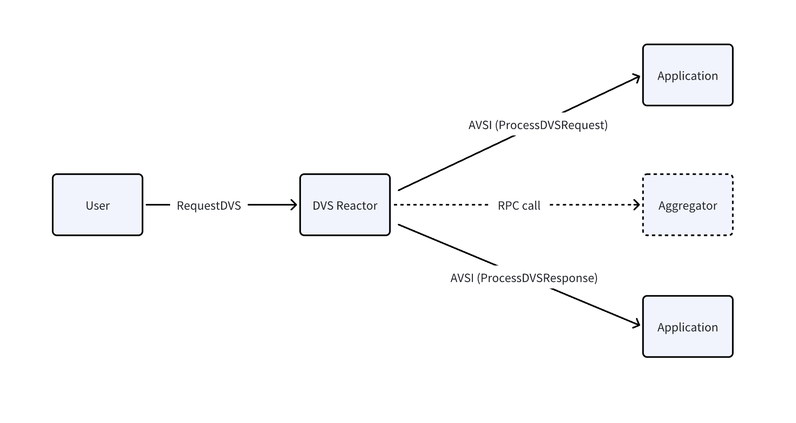

# AVSI Spec

## Introduction

AVSI (Application Verifiable Service Interface) is the interface for interaction between the security layer and the application layer of PellDVS. The interface contains a series of methods, each of which includes a Request and Response. Application layer nodes need to implement the logic of the interface to interact with security layer nodes.

## Overview and Basic Concepts

The main role of Application in Operator is to process specific task requests. Each type of task request may require different processing logic, such as calculating square numbers, obtaining token price information, etc., which belong to different task types. Application is the module in Operator node that actually executes the processing logic of these tasks and reports the task results.

The application layer consists of two parts: task distribution and task execution. Task distribution is handled by additional nodes (such as the Task Dispatcher in the pelldvs-example repository). After receiving a task request, the DVS Reactor module in the Operator node will call the Application registered through the AVSI interface for specific task processing.



## Methods

### ProcessDVSRequest

#### Request

```
message RequestProcessDVSRequest {
  DVSRequest        request = 1;
  repeated Operator operator = 2;
}

message DVSRequest {
  bytes                 data                         = 1;
  int64                 height                       = 2;
  int64                 chain_id                     = 3;
  repeated uint32       group_numbers                = 4;
  repeated uint32       group_threshold_percentages  = 5;
}

message Operator {
  bytes id          = 1;  // [32]byte
  bytes address     = 2;  // [20]byte
  string meta_uri   = 3;
  string socket     = 4;
  int64 stake       = 5;
  OperatorPubkeys pubkeys = 6;
}

message OperatorPubkeys {
  bytes g1_pubkey = 1;  // [32]byte
  bytes g2_pubkey = 2;  // [32]byte
}
```

#### Response

```
message ResponseProcessDVSRequest {
  uint32          code            = 1;
  bytes           data            = 2;
  string          log             = 3;  // nondeterministic
  string          info            = 4;  // nondeterministic
  repeated Event  events          = 5
      [(gogoproto.nullable) = false, (gogoproto.jsontag) = "events,omitempty"];  
  string          codespace       = 6;
  bytes           response        = 7;
  bytes           response_digest = 8;
}
```

#### Usage

- DVS Reactor will call this function, in which the Application performs the real task calculation logic and then returns the calculation result to DVS Reactor.

---

### ProcessDVSResponse

#### Request

```
message RequestProcessDVSResponse {
  DVSRequest                 dvs_request = 1;
  DVSResponse                dvs_response = 2;
}

message DVSRequest {
  bytes                 data                         = 1;
  int64                 height                       = 2;
  int64                 chain_id                     = 3;
  repeated uint32       group_numbers                = 4;
  repeated uint32       group_threshold_percentages  = 5;
}

message DVSResponse {
  bytes                          data                             = 1;
  string                         error                            = 2;
  bytes                          hash                             = 3;
  repeated bytes                 non_signers_pubkeys_g1           = 4;
  repeated bytes                 group_apks_g1                    = 5;
  bytes                          signers_apk_g2                   = 6;
  bytes                          signers_agg_sig_g1               = 7;
  repeated uint32                non_signer_group_bitmap_indices  = 8;
  repeated uint32                group_apk_indices                = 9;
  repeated uint32                total_stake_indices              = 10;
  repeated NonSignerStakeIndice  non_signer_stake_indices         = 11;
}
```

#### Response

```
message ResponseProcessDVSResponse {
  uint32          code            = 1;
  bytes           data            = 2;
  string          log             = 3;  // nondeterministic
  string          info            = 4;  // nondeterministic
  repeated Event  events          = 5
      [(gogoproto.nullable) = false, (gogoproto.jsontag) = "events,omitempty"];  
  string          codespace       = 6;
}
```

#### Usage

- This function will process the verified and aggregated task results, such as calling the Task contract of the application layer to chain the results.
